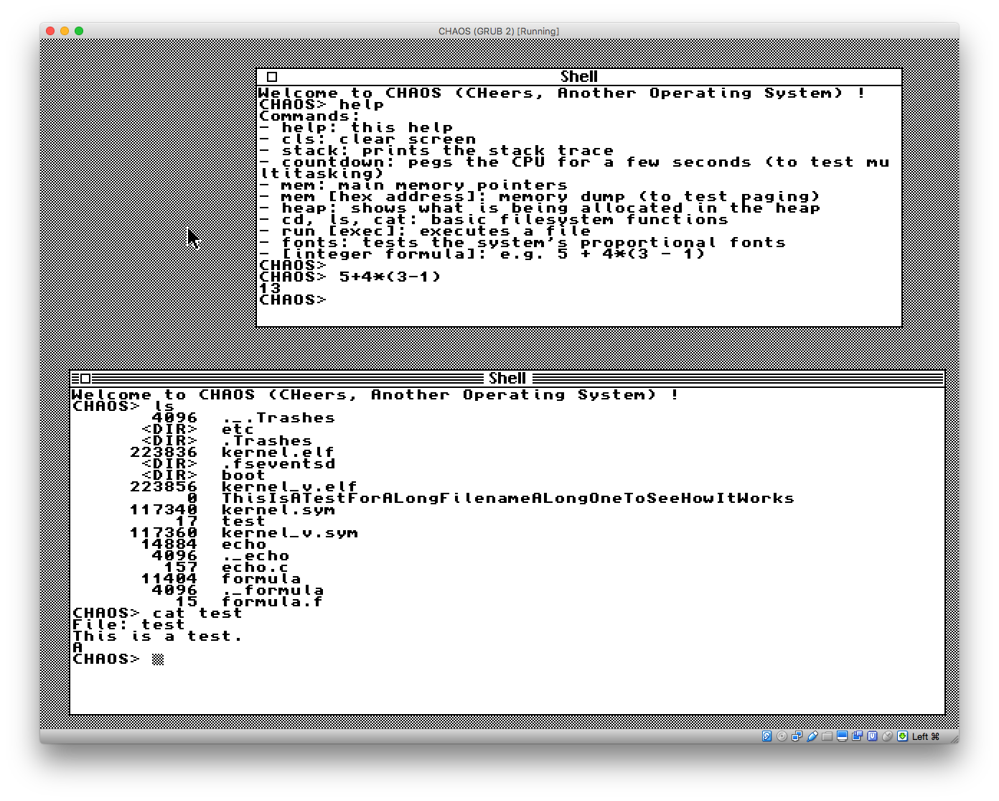

# CHAOS (CHeers, Another Operating System)

CHAOS is a simple 32-bit multitasking operating system I am writing from scratch in assembly and C in order to better understand how operating systems work.

Here are its highlights:

- Full use of the i386 protected mode with paging and use of both kernel and user modes
- Preemptive multitasking
- A simple windowing system with PS/2 mouse support (available in both text and VGA mode)
- A text-based shell
- FAT12 support (as well as long filename support), allowing shell commands such as "cd", "ls" and "cat"
- Can run an ELF executable from the disk that prints on the screen using a system call
- DWARF support, allowing to have a descriptive kernel stack trace with the function name, file and line number
- A networking interface (Ethernet/IP/UDP stack, in progress)

## The processes

The operating system launches two processes, each one represented by a shell in its own window (type "help" to see the available commands). Those processes are run concurrently and can perform tasks in parallel (this is the purpose of the "countdown" command). Press the Tab key to switch from one shell to the other.

The up and down arrow keys are used to go through the previous shell commands. The left and right keys are used to move the address for the memory dump viewer ("mem &lt;address&gt;")

When the processes are waiting for a keyboard input, they are in polling mode, which means they are waiting for the keyboard handler to store any keystroke in their buffer. A process in polling mode is not being given cycles by the scheduler.

The two shell processes are run in user mode (ring 3) but still call many kernel primitives directly. In the future they will be using only system calls.

## Loading a process from disk

CHAOS offers a rudimentary way to run an executable from the disk. This executable must be compiled in the ELF format, have a relocation table (ld -q option) and use the only system call currently implemented: syscall_printf(). There are two examples right now: `echo` and `formula` (see in /utils/).

The OS will load the file into memory, go through the relocation table, relocate the pointers and execute the process.

## How to run it

The makefile is designed to work with the GNU's gcc and ld. The build can happen on any platform as long as it's a version of gcc which can generate ELF binaries. On OS X, Macports' version of gcc and ld only generate Mach-O executable, so you will need to manually download and build binutils and gcc (see http://wiki.osdev.org/GCC_Cross-Compiler)

The resulting image is chaos.img, which is a hard disk image (formerly a floppy disk image). You can run it using the x86 emulator [bochs](http://bochs.sourceforge.net/) (once installed just type 'bochs', the bochrc file from the project points it to the right image) or on VirtualBox by using vm_chaos.vmdk as the disk.

## Thanks

This project has been possible thanks to the numerous resources available on the Internet:

- [Writing a Simple Operating System from Scratch](https://www.cs.bham.ac.uk/~exr/lectures/opsys/10_11/lectures/os-dev.pdf)
- [BSOS](https://github.com/aplabs/bsos)
- [Operating System Development Series](http://www.brokenthorn.com/Resources/OSDevIndex.html)
- [Bran's Kernel Development Tutorial](http://www.osdever.net/bkerndev/Docs/intro.htm)
- [JamesM's kernel development tutorials](http://www.jamesmolloy.co.uk/tutorial_html/)
- And of course [OSDev.org](http://wiki.osdev.org/Main_Page) and the people answering on its forums
