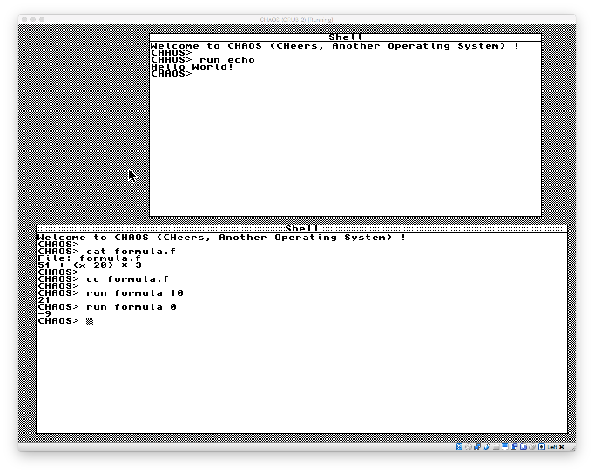

# Utilities

This directory contains a few "user processes". Not all these proceses are really user processes in the sense that their code is part of the kernel, and they call directly several kernel functions. `echo` and `formula` however are compiled separately and call kernel functions through system calls.

## Shell

That is the first processes.

## Edit

This is a basic text editor. Use Ctrl+S to save, and Ctrl+C to quit.

## Echo

This is the simplest user process compiled separately. It is built by running `makefile echo` and executed by typing `run echo` in the shell.

## Formula Parser

Although not an actual process, this code is used by both the shell and the formula compiler to parse mathematical formulas involving all 4 basic operations (+, -, *, /) as well as parenthesese.

## Formula Compiler

`cc` is a formula compiler, which compiles a math formula like the kind accepted by the shell and compiles it into native x86 language. The result is an ELF binary which is compiled independently from the kernel and executed just like `echo`, with the exception that you pass in argument the variable `x`:

    CHAOS> cat formula.f
    File: formula.f
    5 + (x - 2) * 7
    CHAOS> cc formula.f
    CHAOS> run formula 10
    61

The current version of `cc` does not generate a full x86 ELF binary - it just replaces the x86 code that computes the formula. The initial binary needs to be generated using `make formula`.
